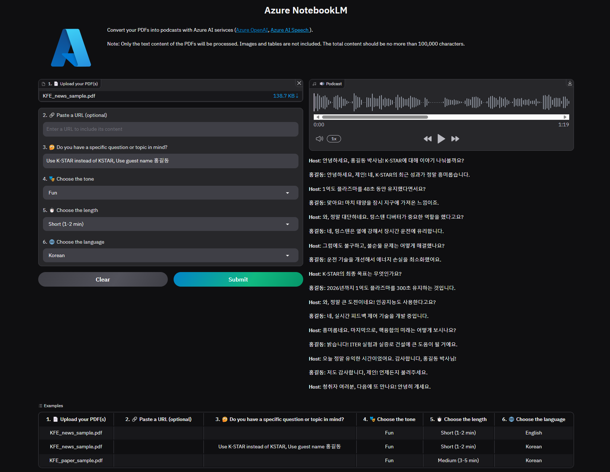

# Azure NotebookLM

## Overview

An Azure version of `Open NotebookLM` using Azure OpenAI and Azure AI Speech.

See original [Open NotebookLM](https://github.com/gabrielchua/open-notebooklm) for more information.



## Prep

Provision following Azure resouces before running the app.

1. Azure OpenAI (gpt-4o) model
   - model version `2024-08-06` or above

2. Azure AI Speech [HD voices](https://learn.microsoft.com/en-us/azure/ai-services/speech-service/high-definition-voices)
   - available regions: East US, Southeast Asia and West Europe.

## Run app

1. copy `env.txt` to `.env` and update values.

2. create a new python environment and install packages.
   ```bash
   conda create -n anblm python=3.10
   conda activate anblm
   pip install -r requirements.txt
   ```

3. run the app.
   ```bash
   python app.py
   ```

4. open the browser, `http://127.0.0.1:7860`.

## Generate Example

To generate examples, remove `.gradio` folder, update `UI_EXAMPLES` in `constants.py` and run tha app.

## Tip

> install [ffmpeg](https://ffmpeg.org/download.html)

To convert `.wav` to `.mp4` with FFMPEG.

```
ffmpeg -i KFE_paper_sample_audio_hd.wav -c:a aac -b:a 192k KFE_paper_sample_audio_hd.mp4
```